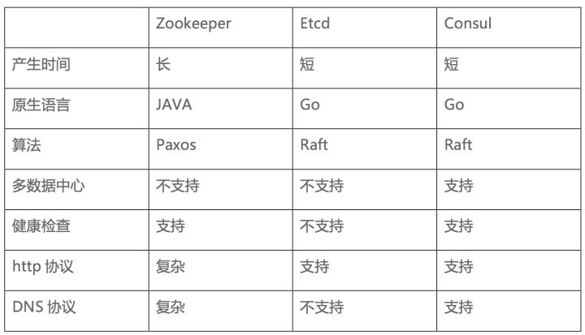
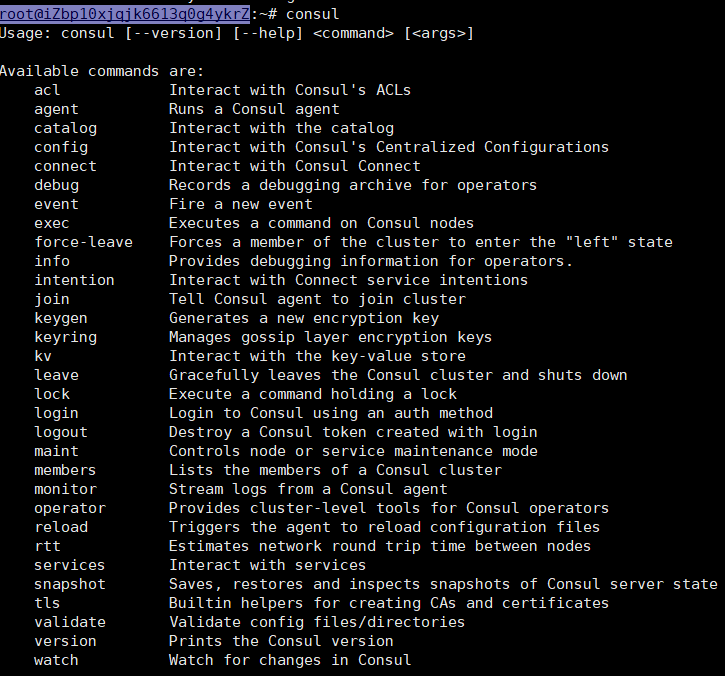
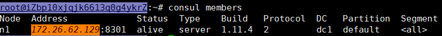
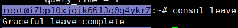
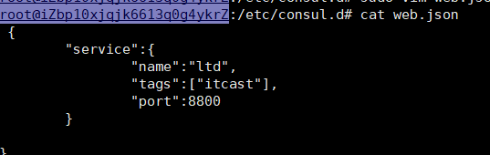
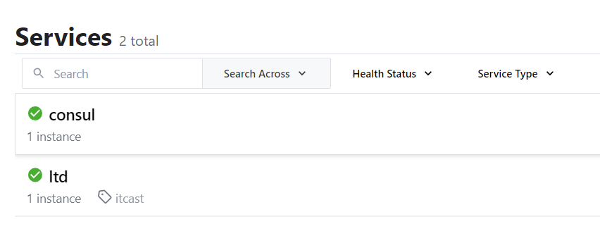

## 服务发现
微服务开发的时候，客户端的一个接口可能需要调用N个服务，客户端必须知道所有服务的网络位置（ip+port）  
以往的做法是把服务的地址放在配置文件活数据库中，这样就有以下几个问题：

- 需要配置N个服务的网络位置，加大配置的复杂性
- 服务的网络位置变化，需要改变每个调用者的配置
- 集群的情况下，难以做负载（反向代理的方式除外）

总结起来一句话：**服务多了，配置很麻烦，问题一大堆**

在**虚拟化或容器化**的环境中，服务实例的启动和销毁是很频繁的，服务地址在动态的变化，如果需要将请求发送到动态变化的服务实例上，至少需要两个步骤：

+ 服务注册 — 存储服务的主机和端口信息

+ 服务发现 — 允许其他用户发现服务注册阶段存储的信息

服务发现的主要优点是可以无需了解架构的部署拓扑环境，只通过服务的名字就能够使用服务，提供了一种服务发布与查找的协调机制。服务发现除了提供服务注册、目录和查找三大关键特性，还需要能够提供健康监控、多种查询、实时更新和高可用性等。

有两种主要的服务发现方式：

+ 客户端发现（client-side service discovery）
+ 服务端发现（server-side discovery）

## 常见服务发现框架
常见服务发现框架 Consul、 ZooKeeper以及Etcd  
- Consul 是强一致性的数据存储，使用 Gossip 形成动态集群。它提供分级键/值存储方式，不仅可以存储数据，而且可以用于注册器件事各种任务，从发送数据改变通知到运行健康检查和自定义命令
- ZooKeeper 是这种类型的项目中历史最悠久的之一，它起源于 Hadoop。它非常成熟、可靠，被许多大公司（YouTube、eBay、雅虎等）使用。
- Etcd是一个采用 HTTP 协议的健/值对存储系统，它是一个分布式和功能层次配置系统，可用于构建服务发现系统。其很容易部署、安装和使用，提供了可靠的数据持久化特性。搭配一些第三方工具，etcd（健/值对存储系统）+ Registrator（服务注册器） + Confd（轻量级的配置管理工具）  



## consul

### 进一步了解consul

Consul是HashiCorp公司推出的开源工具，用于实现分布式系统的服务发现与配置。包含多个组件,但是作为一个整体,为基础设施提供服务发现和服务配置的工具,提供以下关键特性:

**服务发现**：consul通过DNS或者HTTP接口使服务注册和服务发现变的很容易，一些外部服务，例如saas提供的也可以一样注册。

**健康检查**：健康检测使consul可以快速的告警在集群中的操作。和服务发现的集成，可以防止服务转发到故障的服务上面。(心跳机制)

**键/值存储**：一个用来存储动态配置的系统。提供简单的HTTP接口，可以在任何地方操作。

**多数据中心**：无需复杂的配置，即可支持任意数量的区域。

> 官方建议：最好是三台或者三台以上的consul在运行，同名服务最好是三台或三台以上，默认可以搭建集群


### consul安装

Consul用Golang实现，因此具有天然可移植性 (支持 Linux、windows和macOS)。
安装非常方便，根据系统选择合适的即可
官方地址：https://www.consul.io/


_以最新为准，2022/4/12 ubuntu安装_
```shell
curl -fsSL https://apt.releases.hashicorp.com/gpg | sudo apt-key add -
sudo apt-add-repository "deb [arch=amd64] https://apt.releases.hashicorp.com $(lsb_release -cs) main"
sudo apt-get update && sudo apt-get install consul
```

若未安装`apt-add-repository`命令,需在第二步之前执行下面命令
```shell
sudo apt-get update
sudo apt-get install software-properties-common
```
> add-apt-repository命令是software-properties-common包的一部分

执行完等待下载完成即可输入
```shell
consul
```
查看consul下面的命令  


### consul常用命令
-`consul agent`
运行agent来维护成员的重要信息、运行检查、服务宣布、查询处理等等。
```shell
Usage: consul agent [options]

  Starts the Consul agent and runs until an interrupt is received. The
  agent represents a single node in a cluster.

HTTP API Options

  -datacenter=<value>
     Datacenter of the agent.

Command Options

  -advertise=<value>
     Sets the advertise address to use.

  -advertise-wan=<value>
     Sets address to advertise on WAN instead of -advertise address.

  -allow-write-http-from=<value>
     Only allow write endpoint calls from given network. CIDR format,
     can be specified multiple times.

  -alt-domain=<value>
     Alternate domain to use for DNS interface.

  -bind=<value>
     Sets the bind address for cluster communication.

  -bootstrap
     Sets server to bootstrap mode.

  -bootstrap-expect=<value>
     Sets server to expect bootstrap mode.

  -check_output_max_size=<value>
     Sets the maximum output size for checks on this agent

  -client=<value>
     Sets the address to bind for client access. This includes RPC, DNS,
     HTTP, HTTPS and gRPC (if configured).

  -config-dir=<value>
     Path to a directory to read configuration files from. This
     will read every file ending in '.json' as configuration in this
     directory in alphabetical order. Can be specified multiple times.

  -config-file=<value>
     Path to a file in JSON or HCL format with a matching file
     extension. Can be specified multiple times.

  -config-format=<string>
     Config files are in this format irrespective of their extension.
     Must be 'hcl' or 'json'

  -data-dir=<value>
     Path to a data directory to store agent state.

  -default-query-time=<value>
     the amount of time a blocking query will wait before Consul will
     force a response. This value can be overridden by the 'wait' query
     parameter.

  -dev
     Starts the agent in development mode.

  -disable-host-node-id
     Setting this to true will prevent Consul from using information
     from the host to generate a node ID, and will cause Consul to
     generate a random node ID instead.

  -disable-keyring-file
     Disables the backing up of the keyring to a file.

  -dns-port=<value>
     DNS port to use.

  -domain=<value>
     Domain to use for DNS interface.

  -enable-local-script-checks
     Enables health check scripts from configuration file.

  -enable-script-checks
     Enables health check scripts.

  -encrypt=<value>
     Provides the gossip encryption key.

  -grpc-port=<value>
     Sets the gRPC API port to listen on (currently needed for Envoy xDS
     only).

  -hcl=<value>
     hcl config fragment. Can be specified multiple times.

  -http-port=<value>
     Sets the HTTP API port to listen on.

  -https-port=<value>
     Sets the HTTPS API port to listen on.

  -join=<value>
     Address of an agent to join at start time. Can be specified
     multiple times.

  -join-wan=<value>
     Address of an agent to join -wan at start time. Can be specified
     multiple times.

  -log-file=<value>
     Path to the file the logs get written to

  -log-json
     Output logs in JSON format.

  -log-level=<value>
     Log level of the agent.

  -log-rotate-bytes=<value>
     Maximum number of bytes that should be written to a log file

  -log-rotate-duration=<value>
     Time after which log rotation needs to be performed

  -log-rotate-max-files=<value>
     Maximum number of log file archives to keep

  -max-query-time=<value>
     the maximum amount of time a blocking query can wait before Consul
     will force a response. Consul applies jitter to the wait time. The
     jittered time will be capped to MaxQueryTime.

  -node=<value>
     Name of this node. Must be unique in the cluster.

  -node-id=<value>
     A unique ID for this node across space and time. Defaults to a
     randomly-generated ID that persists in the data-dir.

  -node-meta=<key:value>
     An arbitrary metadata key/value pair for this node, of the format
     `key:value`. Can be specified multiple times.

  -non-voting-server
     (Enterprise-only) DEPRECATED: -read-replica should be used instead

  -pid-file=<value>
     Path to file to store agent PID.

  -primary-gateway=<value>
     Address of a mesh gateway in the primary datacenter to use to
     bootstrap WAN federation at start time with retries enabled. Can be
     specified multiple times.

  -protocol=<value>
     Sets the protocol version. Defaults to latest.

  -raft-protocol=<value>
     Sets the Raft protocol version. Defaults to latest.

  -read-replica
     (Enterprise-only) This flag is used to make the server not
     participate in the Raft quorum, and have it only receive the data
     replication stream. This can be used to add read scalability to
     a cluster in cases where a high volume of reads to servers are
     needed.

  -recursor=<value>
     Address of an upstream DNS server. Can be specified multiple times.

  -rejoin
     Ignores a previous leave and attempts to rejoin the cluster.

  -retry-interval=<value>
     Time to wait between join attempts.

  -retry-interval-wan=<value>
     Time to wait between join -wan attempts.

  -retry-join=<value>
     Address of an agent to join at start time with retries enabled. Can
     be specified multiple times.

  -retry-join-wan=<value>
     Address of an agent to join -wan at start time with retries
     enabled. Can be specified multiple times.

  -retry-max=<value>
     Maximum number of join attempts. Defaults to 0, which will retry
     indefinitely.

  -retry-max-wan=<value>
     Maximum number of join -wan attempts. Defaults to 0, which will
     retry indefinitely.

  -segment=<value>
     (Enterprise-only) Sets the network segment to join.

  -serf-lan-allowed-cidrs=<value>
     Networks (eg: 192.168.1.0/24) allowed for Serf LAN. Can be
     specified multiple times.

  -serf-lan-bind=<value>
     Address to bind Serf LAN listeners to.

  -serf-lan-port=<value>
     Sets the Serf LAN port to listen on.

  -serf-wan-allowed-cidrs=<value>
     Networks (eg: 192.168.1.0/24) allowed for Serf WAN (other
     datacenters). Can be specified multiple times.

  -serf-wan-bind=<value>
     Address to bind Serf WAN listeners to.

  -serf-wan-port=<value>
     Sets the Serf WAN port to listen on.

  -server
     Switches agent to server mode.

  -server-port=<value>
     Sets the server port to listen on.

  -syslog
     Enables logging to syslog.

  -ui
     Enables the built-in static web UI server.

  -ui-content-path=<value>
     Sets the external UI path to a string. Defaults to: /ui/

  -ui-dir=<value>
     Path to directory containing the web UI resources.
```

**info**指令提供了各种操作时可以用到的debug信息，对于client和server，info有返回不同的子系统信息，目前有以下几个KV信息：agent(提供agent信息)，consul(提供consul库的信息)，raft(提供raft库的信息)，serf_lan(提供LAN gossip pool),serf_wan(提供WAN gossip pool)

**leave**指令触发一个优雅的离开动作并关闭agent，节点离开后不会尝试重新加入集群中。运行在server状态的节点，节点会被优雅的删除，这是很严重的，在某些情况下一个不优雅的离开会影响到集群的可用性。

**members**指令输出consul agent目前所知道的所有的成员以及它们的状态，节点的状态只有alive、left、failed三种状态。

> -detailed：输出每个节点更详细的信息       
> -rpc-addr：一个rpc地址，agent可以链接上来发送命令，如果没有指定，默认是127.0.0.1:8400       
> -status：过滤出符合正则规则的节点    

**reload**指令可以重新加载agent的配置文件。SIGHUP指令在重新加载配置文件时使用，任何重新加载的错误都会写在agent的log文件中，并不会打印到屏幕。

- `consul members`查看当前集群多少个成员

```shell
#节点  网络地址              状态    类型     版本     协议     数据中心         分管部分 
Node  Address             Status  Type    Build   Protocol  DC       Partition  Segment
n1    172.26.62.129:8301  alive   server  1.11.4  2         dc1      default    <all>

```
- `consul info` 查看当前consul的ip信息

- `consul leave` 优雅的关闭consul  ^C 也能够关闭    


###consul使用
consul有两种运行模式，server和client
`consult agent -server`  以服务端方式
`consult agent`          以客户端方式

每个数据中心至少必须拥有一个server。一个client是一个非常轻量级的进程.用于注册服务,运行健康检查和转发对server的查询,agent必须在集群中的每个主机上运行.

####server模式启动
```shell
consul agent -server -bootstrap-expect 1 -data-dir /tmp/consul -node=n1 -bind=172.26.62.129 -ui -rejoin -config-dir=/etc/consul.d/ -client 0.0.0.0
```

> - `-server` ： 定义agent以server模式运行
> - `-bootstrap-expect` ：在一个datacenter中期望提供的server节点数目，当该值提供的时候，consul一直等到达到指定sever数目的时候才会引导整个集群，该标记不能和bootstrap共用，当只有一个的时候直接用 -bootstrap就行
> - `-bind`：该地址用来在集群内部的通讯，集群内的所有节点到地址都必须是可达的，默认是0.0.0.0，应修改为主机ip地址(这里应该使用内网ip，而访问的时候为公网ip)
> - `-node`：节点在集群中的名称，在一个集群中必须是唯一的，默认是该节点的主机名
> - `-ui`： 启动web界面:默认端口8500
> - `-rejoin`：使consul忽略先前的离开，在再次启动后仍旧尝试加入集群中。
> - `-config-dir`：配置文件目录，里面所有以.json结尾的文件都会被加载
> - `-client`：consul服务侦听地址，这个地址提供HTTP、DNS、RPC等服务，默认是127.0.0.1所以不对外提供服务，如果你要对外提供服务改成0.0.0.0
> - `data-dir`：提供一个目录用来存放agent的状态，所有的agent允许都需要该目录，该目录必须是稳定的，系统重启后都继续存在

####注册服务到consul
步骤：
1. 进入配置文件目录 `cd /etc/consul.d/`
2. 创建json文件 `sudo vim web.json`
3. 按照json语法，填写服务信息       

4. 重新启动consul
```shell
consul agent -server -bootstrap-expect 1 -data-dir /tmp/consul -node=n1 -bind=172.26.62.129 -ui -rejoin -config-dir=/etc/consul.d/ -client 0.0.0.0
```
5.查询服务 浏览器查看/命令查看  

```shell
curl -s 127.0.0.1:8500/v1/catalog/service/faceid
```

####健康检查
1. `sudo vim /etc/consul.d/web.json`打开配置文件
2. 写入服务的配置信息
```json
 "check":{
            "id":"api",//需要检查的id
            "name":"ltd check",//检查名
            "http":"http://172.26.62.129:8800",//被检查服务的地址
            "interval":"5s",//每5s请求一次
            "timeout":"1s"//多久未返回就算不健康
}
```
3. 执行命令 
- 若未关闭consul服务，执行`consul reload`
- 若已经关闭，执行`consul agent -server -bootstrap-expect 1 -data-dir /tmp/consul -node=n1 -bind=172.26.62.129 -ui -rejoin -config-dir=/etc/consul.d/ -client 0.0.0.0`
4. 浏览器查看服务健康状况
- 此时查看为不健康的，因为此时没有服务实时回复
####client模式启动
```shell
consul agent -data-dir /tmp/consul -node=n2 -bind= -config-dir /etc/consul.d -rejoin -join 172.26.62.129
```
5. consul健康检查的必须是`script/http/tcp/ttl`中的一种，上面的"http"可以更改为其他几种即可
